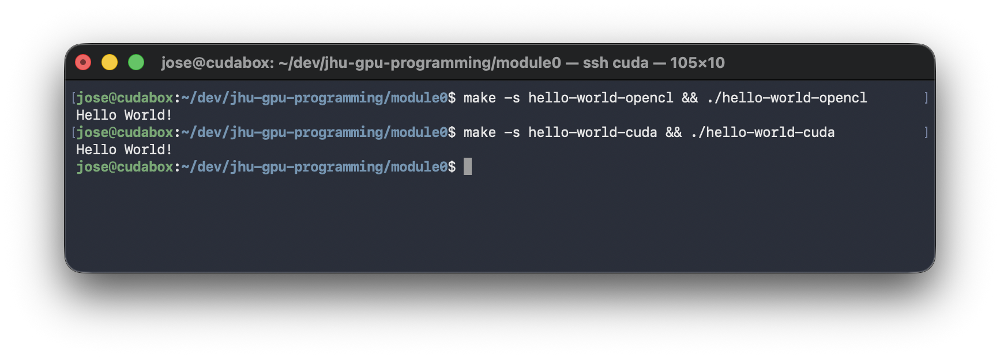

# Module 0: Hello World (CUDA + OpenCL)

Simple “Hello World” examples for both CUDA and OpenCL.

## Build + Run

OpenCL:

`make -s hello-world-opencl && ./hello-world-opencl`

CUDA:

`make -s hello-world-cuda && ./hello-world-cuda`

Clean:

`make clean`

## Screenshot



## Make Targets

Explainer for the make targets found in `Makefile`.

```
hello-world-cuda: hello-world.cu
	nvcc -O2 hello-world.cu -o hello-world-cuda
```

- Builds the CUDA version using `nvcc`.
- Produces the executable `./hello-world-cuda`.

```
hello-world-opencl: hello_world_cl.c
	gcc -O2 hello_world_cl.c -o hello-world-opencl -lOpenCL
```

- Builds the OpenCL version using `gcc`.
- Links with `-lOpenCL` to include OpenCL runtime library `libOpenCL.so`.
- Produces the executable `./hello-world-opencl`.
