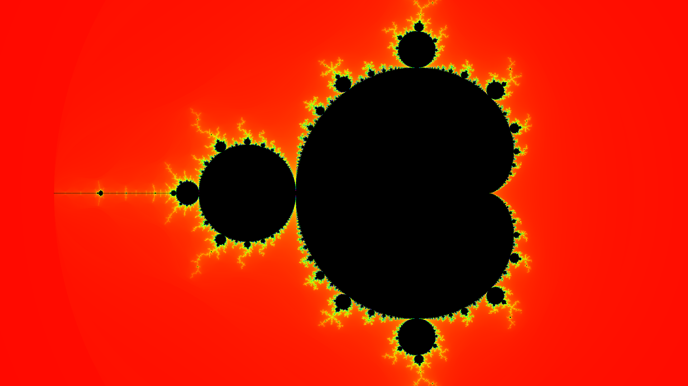
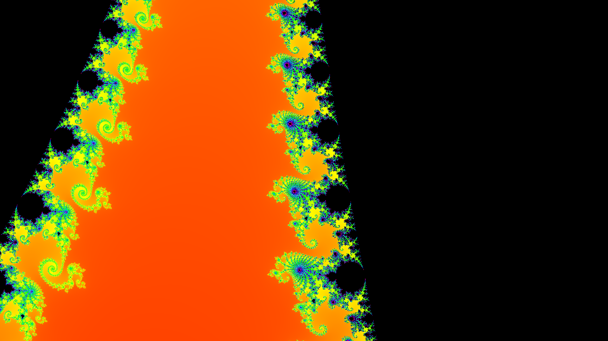

# OpenCL Mandelbrot Set Generator

## Goals

The goal of this assignment is to build an OpenCL application around a computation that demonstrates as many OpenCL concepts from this section of the course as possible (buffers and sub-buffers, vector types, 2D NDRange execution, event profiling, and memory mapping) and utilizes the GPU for a strongly parallelizable use case. The Mandelbrot set was a natural choice because each pixel is independent and as a bonus the output is immediately recognizable.

## The Mandelbrot Set

The [Mandelbrot set](https://en.wikipedia.org/wiki/Mandelbrot_set) is the set of complex numbers $c$ for which the iteration $z_{n+1} = z_n^2 + c$ (starting from $z_0 = 0$) does not diverge. Each pixel maps to a point $c$ on the complex plane. The algorithm iterates until $|z|^2 > 4$ (the escape radius) or a maximum iteration count is reached, then colors the pixel based on how quickly it escaped. Points inside the set never escape and are colored black.

Naive integer iteration counts produce harsh color bands. A standard fix is smooth (continuous) coloring. Instead of recording just the integer iteration, we compute a fractional escape value $\nu = n + 1 - \log_2(\log_2 |z_n|^2 / 2)$, which gives a continuous gradient across the boundary. The kernel uses `float2` vectors for the complex arithmetic, so the core loop is just:

```text
z = (float2)(zr2 - zi2 + c.x, 2.0f * z.x * z.y + c.y);
```

## Challenges

Getting sub-buffers right was the main difficulty. Each strip needs its own y-bounds recomputed from the strip's pixel offset, and the sub-buffer origin must be byte-aligned. An early off-by-one in the offset calculation produced visible seams between strips; distributing the remainder rows across the first few strips fixed it.

Keeping functions under 40 lines required splitting the frame loop's kernel dispatch, readback, and file-writing into clearly scoped blocks. The animation mode added complexity because the zoom, view bounds, and output filename all change per frame, but the OpenCL resources (context, queue, kernel, buffers) are created once and reused.

## OpenCL Implementation

The host program starts with OpenCL boilerplate (platform and device discovery, context creation, and a profiling-enabled command queue). It reads `mandelbrot.cl`, compiles it with `-cl-fast-relaxed-math`, and creates the `mandelbrot_smooth` kernel.

Rather than writing to a single monolithic buffer, the program allocates one main `cl_mem` buffer for the full image and then carves it into four horizontal strips using `clCreateSubBuffer`. Each strip gets its own y-coordinate bounds recomputed from its pixel offset, so the kernel writes directly into the correct region of the parent buffer without any host-side stitching.

The kernel is dispatched once per strip as a 2D NDRange with 16×16 local work groups. Each dispatch records a `cl_event` so per-strip execution times can be queried later via `clGetEventProfilingInfo`. After all four events complete (`clWaitForEvents`), the main buffer is mapped into host address space with `clEnqueueMapBuffer`, the pixel data is copied out, and the mapping is released. The host then converts the smooth iteration values to RGB via an HSV color ramp and writes a PPM file.

When `--frames N` is passed, the program reuses the same OpenCL resources and loops over exponentially interpolated zoom levels ($z_f = z_\text{start} \cdot (z_\text{end}/z_\text{start})^{f/(N-1)}$), writing numbered frames that `make_mp4.sh` stitches into an MP4 via ffmpeg. An optional `--cpu` flag runs the same algorithm single-threaded for a direct speedup comparison.

## Results

Default view (1920×1080, 256 iterations):



50× zoom into the Seahorse Valley at $-0.7453 + 0.1127i$ (512 iterations):



A 20-second zoom animation (600 frames) is in [output/mandelbrot_zoom.mp4](output/mandelbrot_zoom.mp4).

On an NVIDIA RTX 3080, the GPU completed an 800×600 image in 0.28 ms compared to 83 ms for the single-threaded CPU (301x speedup). At 1920×1080 with 512 iterations, the kernel still finishes in under 1 ms. All 600 animation frames render in about 2 seconds total and encode to a 54 MB MP4.

## Quick Start

```bash
make                # build + images + video
make build          # compile only
make images         # generate PNG screenshots
make video          # generate 20s zoom MP4
```

Usage:

```bash
./mandelbrot --width 1920 --height 1080 --iter 512
./mandelbrot --cpu --width 800 --height 600
./mandelbrot --frames 300 --zoom-end 5000 --cx -0.7453 --cy 0.1127
./make_mp4.sh --fps 60
```
