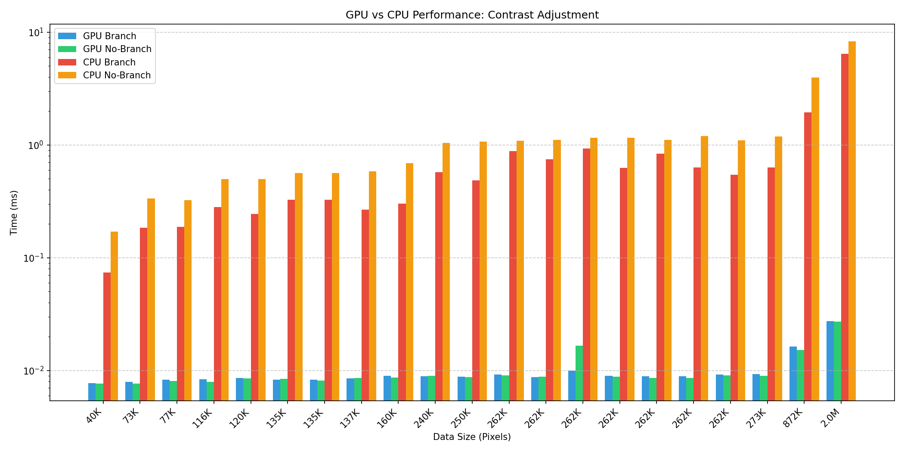
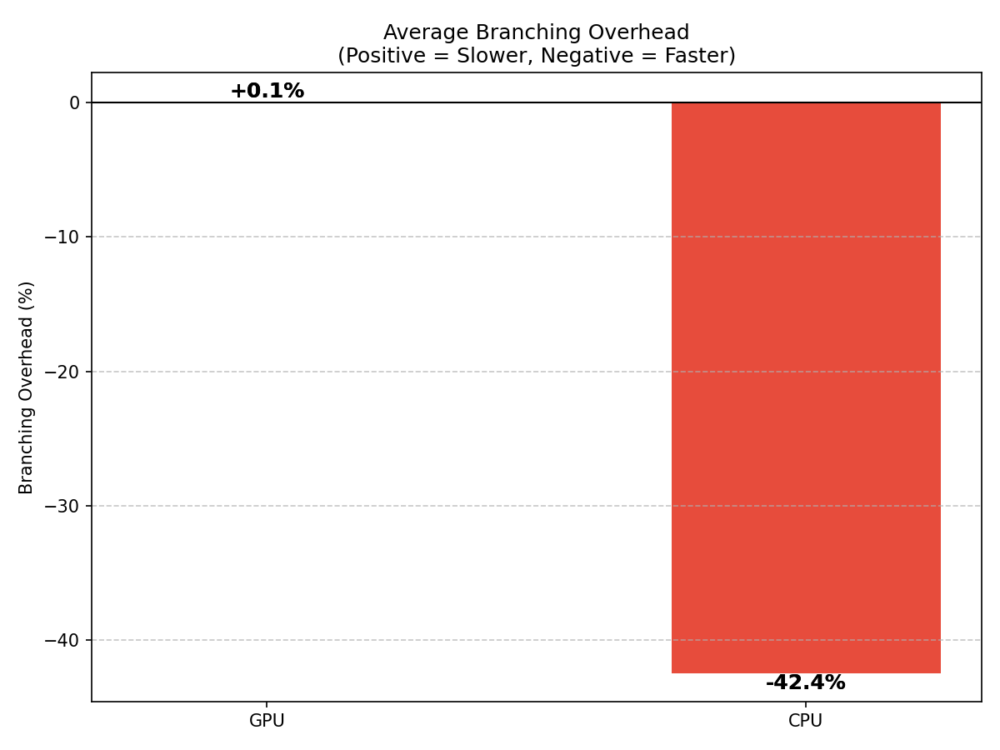
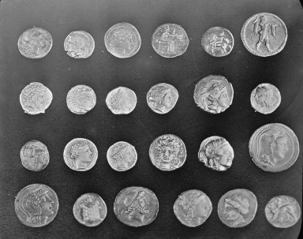

# Module 3 Assignment

Comparing GPU and CPU performance with and without conditional branching using contrast adjustment of images.

## Quick Start

```bash
make
```

Or step by step:

```bash
make preprocess
make build
make run
make postprocess
```

## Results

### Performance Charts





### Interpretation

Branching had a large negative effect on the CPU contrast processing, but almost no effect on the GPU. I'm not sure why the GPU branching didn't perform worse, it might be due to the dataset (distribution of grey scale pixel) or how the branching and non-branching was implemented.

### Before and After

| Original | Contrast Adjusted |
| ---------- | ------------------- |
|  |  |
|  |  |
|  |  |
|  |  |
|  |  |

## Usage

```bash
./assignment.exe <image_index> <block_size>
```

- `image_index`: 0 = all images, 1-21 = specific image
- `block_size`: threads per block (default 256)

Examples with different block sizes:

```bash
./assignment.exe 0 64
./assignment.exe 0 128
./assignment.exe 0 256
./assignment.exe 0 512
```

## Thread Configurations

Each image has a different pixel count, which determines the total number of threads launched. This varies threads via image selection rather than by a thread count cli argument.

## Stretch Problem

Code Issues include:

1. Syntax error on line:

    ```cpp
    std::cout <endl<< " Time elapsed GPU = " << std::chrono::duration_castchrono::nanoseconds>(stop - start).count() << "ns\n";
    ```

    - `std::cout <endl<<` should be `std::cout << ... << std::endl;`
    - `duration_castchrono::nanoseconds>` should be `duration_cast<std::chrono::nanoseconds>`

2. `N` is not defined in the main function, but `int a[N], b[N], c[N]` are stack-allocated. If `N` is very large, this could overflow the stack.

3. `add` kernel is launched after start timer, but without a `cudaDeviceSynchronize()` before the stop timer we're just measuring the launch time of the `add` kernel, not the execution time.

Good Qualities include:

1. Handles command line arguments with `argc` checks, allowing the user to configure `blocks` and `threads` without recompiling. Printing the updated values is also a nice touch.

2. Every `cudaMalloc` has a corresponding `cudaFree`, and host-to-device/device-to-host `cudaMemcpy` calls are paired correctly.
