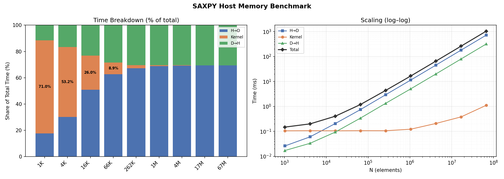
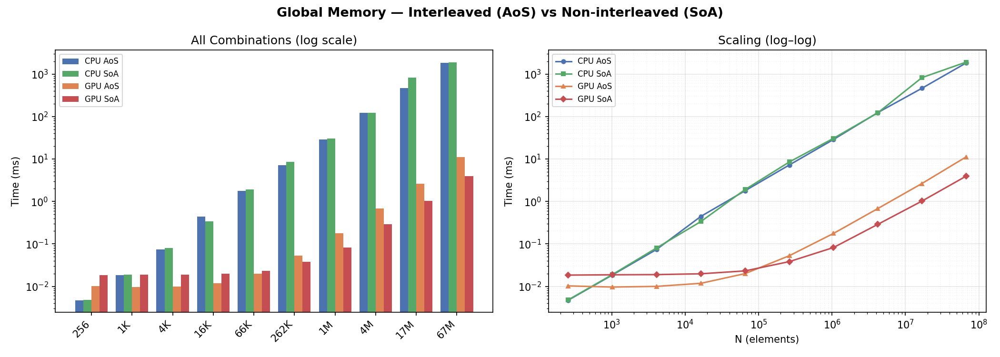

# Module 4 — Host Memory & Global Memory

## Host Memory (SAXPY)

The SAXPY kernel computes $y = a \cdot x + y$ across `N` floats. Timed three phases separately — host-to-device transfer, kernel execution, and device-to-host transfer — across array sizes from 1K to 67M elements.

**Takeaway:** Memory transfer dominates, not compute. At large sizes, the kernel accounts for less than 1% of total time, the rest is data movement. Minimizing host-to-device/dive-to-host transfers is clearly an impactful CUDA optimization.

---

## Global Memory (Interleaved vs Non-interleaved)

Compares two data layouts for a struct with four `unsigned int` fields — interleaved (Array of Structs / AoS) vs non-interleaved (Struct of Arrays / SoA) — on both CPU and GPU, across sizes from 256 to 1M elements.

**Takeaway:** Memory layout matters on the GPU. SoA enables coalesced access (adjacent threads read adjacent addresses) and is consistently faster than AoS. On the CPU both layouts perform similarly, but on the GPU the gap is dramatic: AoS wastes ~75% of each memory transaction.
