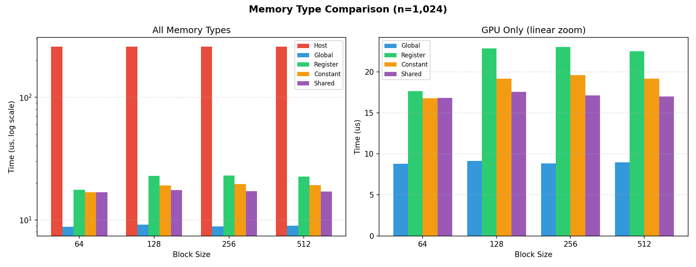
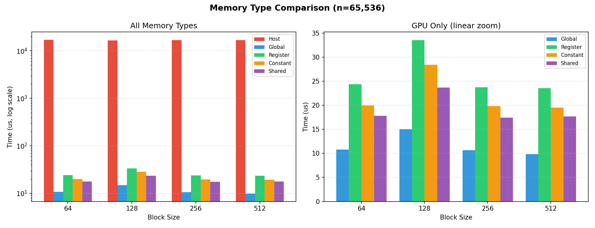
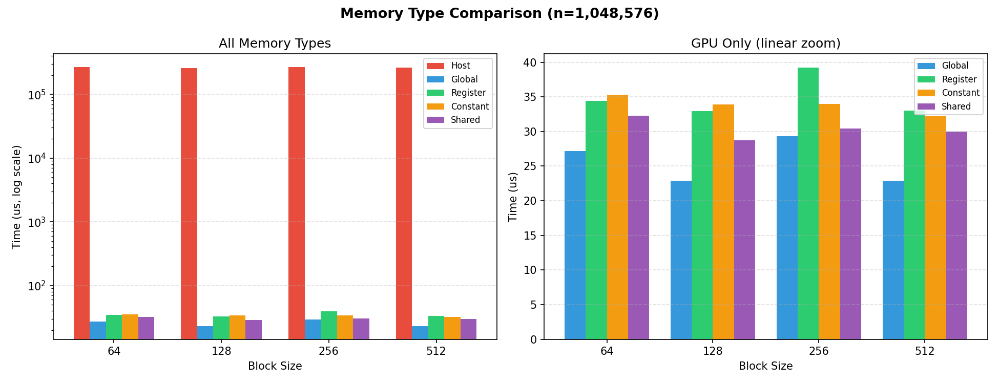
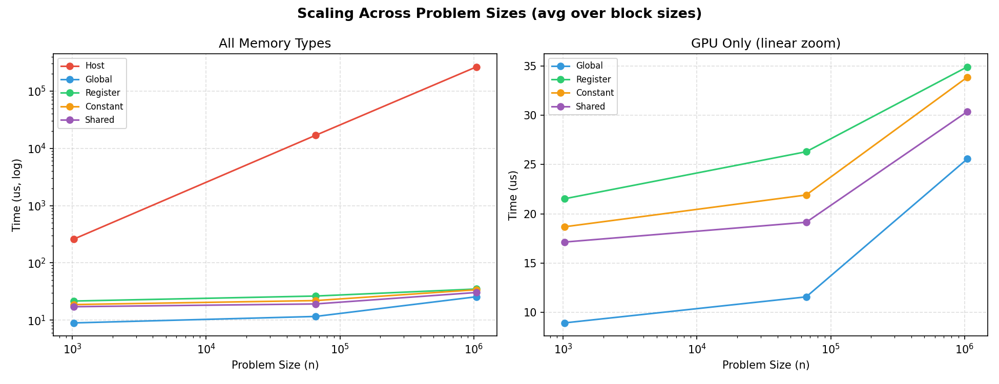

# Module 5 Assignment

Comparing CUDA memory types (host, global, register, constant, shared) by performing the same vector scale operation across each, with variable thread counts and block sizes. The Makefile sweeps 3 problem sizes (1,024 · 65,536 · 1,048,576) × 4 block sizes (64 · 128 · 256 · 512) = 12 configurations.

## Quick Start

```bash
make
```

Or step by step:

```bash
make build
make run
```

`make run` builds the CUDA binary, sweeps all thread/block combinations, writes `performance.csv`, and generates charts via `uv run postprocess.py`.

## Results

### Charts

Each chart shows all five memory types (log scale, left) and a GPU-only linear zoom (right) for a fixed problem size across block sizes.







Average timing across block sizes, showing how each memory type scales with problem size.



### Interpretation

Host (CPU) time scales steeply with problem size, from ~259 us at n=1,024 up to ~265,000 us at n=1,048,576. All GPU types stay in the 8 to 39 us range.

Global memory is the fastest GPU type (~8-29 us). Shared and constant land in the ~17-35 us range. Shared benefits from loading the tile once and reusing it across the 100 iterations, and constant broadcasts the scale factor efficiently through its cache. Register ends up slowest on the GPU side (~17-39 us), probably because the compiler generates essentially the same code as global but without any caching advantage.

Block size has minimal effect. Even 64 threads per block is enough to keep the GPU busy.

## Usage

```bash
./build/vector_scale <total_threads> <block_size> [csv_path]
```

- `total_threads`: number of elements to process (rounded up to a multiple of `block_size`)
- `block_size`: threads per block
- `csv_path`: optional path to append CSV timing data

Examples:

```bash
./build/vector_scale 1024 256
./build/vector_scale 65536 128
./build/vector_scale 1048576 512 performance.csv
```

## Memory Types and Register Allocation

| Type | Implementation | How It's Used |
| --- | --- | --- |
| Host | `host_scale()` CPU loop | `malloc`'d arrays, sequential iteration |
| Global | `global_scale` kernel | Read/write directly from `cudaMalloc`'d arrays |
| Register | `register_scale` kernel | Load into local `float tmp`, operate, store back |
| Constant | `constant_scale` kernel | Scale factor in `__constant__` memory via `cudaMemcpyToSymbol` |
| Shared | `shared_scale` kernel | Tile input into `__shared__` array, `__syncthreads()`, then scale |

Compiled with `nvcc -Xptxas -v` to verify register usage:

| Kernel | Registers | Shared Memory |
| --- | --- | --- |
| `global_scale` | 6 | 0 bytes |
| `register_scale` | 6 | 0 bytes |
| `constant_scale` | 6 | 0 bytes |
| `shared_scale` | 6 | 340 bytes cmem |
