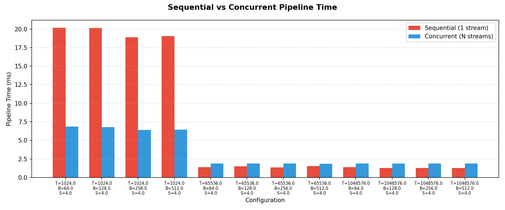
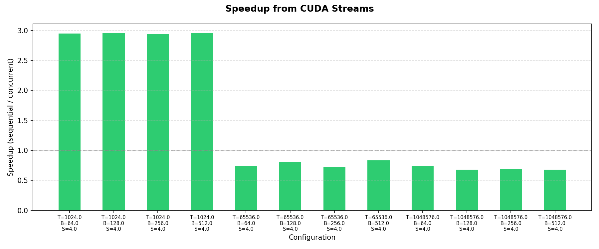
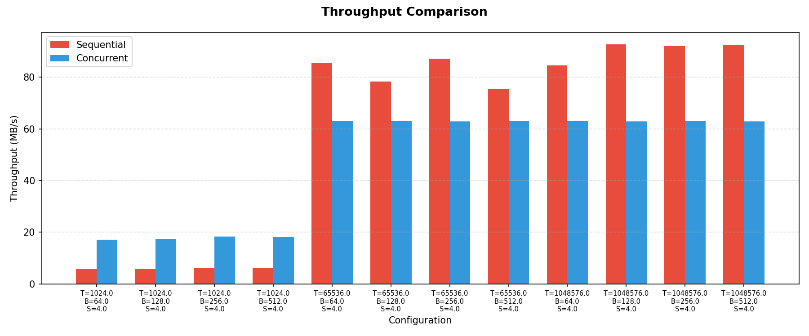

# Module 6 Assignment

Comparing sequential (1 stream) vs concurrent (N streams) CUDA pipelines by hashing words from the [Bluesky](https://bsky.app/) firehose into a frequency histogram. The Makefile sweeps 3 problem sizes (1,024 · 65,536 · 1,048,576 threads) x 4 block sizes (64 · 128 · 256 · 512) = 12 configurations, each with 4 concurrent streams.

## Quick Start

```bash
make
```

Or step by step:

```bash
make build
make run
```

`make run` collects 10,000 live Bluesky posts via WebSocket, runs the CUDA binary across all thread/block combinations, writes `data/performance.csv`, and generates charts via `uv run postprocess.py`.

## Results

### Charts







### Interpretation

At 1,024 threads the GPU is undersubscribed, so each stream's kernel runs longer and there is real opportunity to overlap H2D, kernel, and D2H across the 4 streams, giving a consistent ~2.95x speedup. At 65,536+ threads a single stream already saturates the GPU, finishing the kernel in ~1.3 ms. The concurrent path still pays ~1.86 ms of stream-management and event-recording overhead, so it ends up slower (0.68–0.84x).

Block size has almost no effect at any thread count. The dataset (~115 KB of Bluesky posts) is small enough that transfer time is negligible; the bottleneck is purely kernel compute time versus stream overhead.

## Usage

```bash
./build/assignment <total_threads> <block_size> --file PATH [--streams N] [--csv PATH]
```

- `total_threads`: total GPU threads to launch
- `block_size`: threads per block
- `--file PATH`: input text file (one post per line)
- `--streams N`: concurrent streams (default 4)
- `--csv PATH`: append a summary row to a CSV file

Examples:

```bash
./build/assignment 65536 256 --file data/posts.txt
./build/assignment 1048576 512 --file data/posts.txt --streams 8
./build/assignment 1024 128 --file data/posts.txt --csv data/performance.csv
```

## Pipeline

Each run executes the same work in two modes:

| Mode | Streams | What happens |
| --- | --- | --- |
| Sequential | 1 | Single stream: H2D → kernel → D2H |
| Concurrent | N | Data is chunked across N streams; H2D, kernel, and D2H overlap across streams |

CUDA events bracket every phase (H2D, kernel, D2H) per stream, giving fine-grained timing. The per-stream histograms are merged on the host and verified to match between sequential and concurrent runs.

## Why FNV-1a?

Words are hashed into a 65,536-bin histogram using [FNV-1a](https://en.wikipedia.org/wiki/Fowler%E2%80%93Noll%E2%80%93Vo_hash_function#FNV-1a_hash), a simple non-cryptographic hash that is just two operations per byte (XOR then multiply). It doesn't need lookup tables or shared memory, and every thread produces the same hash for the same word.
