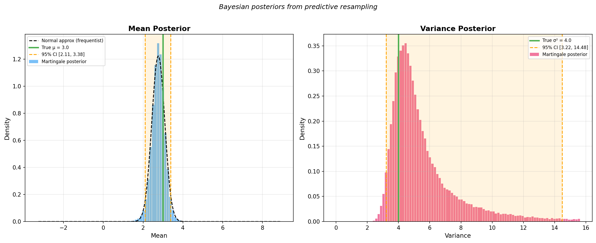
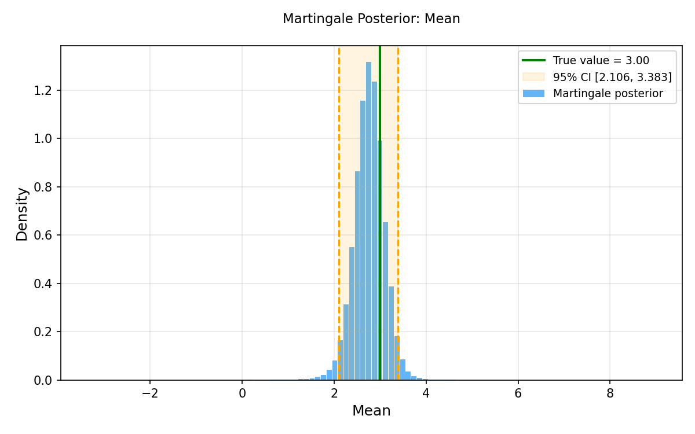
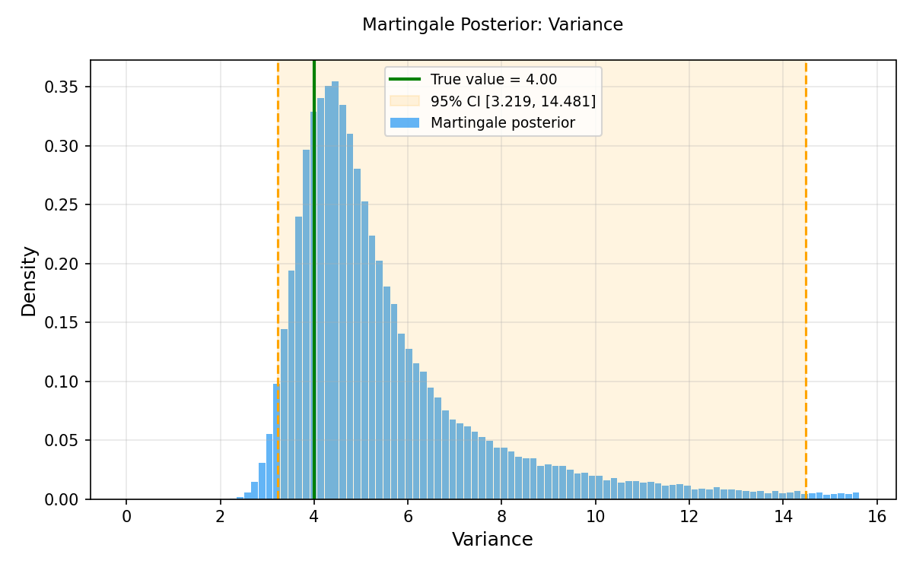

# Module 9 Assignment — Martingale Posterior via Predictive Resampling

## Goals

I wanted to implement a Bayesian inference method that I learned about last semester on the GPU using two CUDA libraries from different modules: cuRAND (Module 7) for random number generation and Thrust (Module 8) for parallel reductions and sorting. The method I chose is the martingale posterior from Fong, Holmes, and Walker (2023), which computes posterior distributions for parameters like the mean and variance without requiring a likelihood function or a prior. The algorithm works by repeatedly predicting future observations through a Pólya urn scheme, then computing statistics from the completed dataset.

## The Martingale Posterior Distribution Paper

Fong, Holmes, and Walker (2021) propose a way to do Bayesian inference without specifying a likelihood or a prior. They reason that if you could observe an entire infinite population, you'd know the true mean, variance, etc. exactly. The only reason for uncertainty about those quantities is when you're limited to a finite sample. So rather than putting a prior on the parameters and deriving a posterior the usual way, you can instead imagine filling in the missing data and computing the parameter from the completed population.

In order to fill in the missing data the authors propose a predictive resampling using a Pólya urn scheme:

1. Start with your observed sample ($n = 50$ points in our case).
2. For each future observation, flip a weighted coin:
   - With probability $n / (n + \alpha)$: resample uniformly from the
     data you already have (observed + previously generated).
   - With probability $\alpha / (n + \alpha)$: draw from a diffuse base
     measure (we use $\mathcal{N}(0, 10^2)$).
3. Do this $T = 500$ times.
4. Compute whatever statistic you want (mean, variance, etc.) from the
   combined 550-point dataset. That gives you one draw from the
   martingale posterior.
5. Repeat $B = 100{,}000$ times to get the full posterior distribution.

The Pólya urn is self-reinforcing, meaning values that show up more in the data get resampled more often, so the posterior concentrates around what the data actually supports. The base measure keeps things from degenerating. This is just the predictive distribution from a Dirichlet process, but used directly for inference rather than as a nonparametric density model.

The algorithm is embarrassingly parallel because each of those 100K runs is completely independent, making it a natural fit for GPU computation. The paper also develops a more sophisticated copula-based predictive that produces smooth density estimates, but it requires bandwidth optimization and permutation averaging that don't parallelize as cleanly on a GPU. The Pólya urn is the foundational result that the copula methods build on, and it handles arbitrary statistics (mean, variance, quantiles) out of the box.

## Implementation

The code uses cuRAND and Thrust in three stages:

1. **Generate observed data** — `curandGenerateNormal` (cuRAND host API) produces 50 draws from $\mathcal{N}(3, 2^2)$.
2. **Predictive resampling** — cuRAND's device API gives each of the 100,000 GPU threads its own RNG state. Each thread runs 500 Pólya urn steps, storing every predicted value so future steps can resample from it. One kernel tracks the running mean; a second uses Welford's online algorithm for the variance.
3. **Posterior summaries** — The 100K statistic values *are* the posterior. Thrust sorts them, computes summary statistics via `reduce` and `transform_reduce`, extracts quantiles, and builds density histograms using `lower_bound` for bin counting.

cuRAND generates every random number in the program (observed data on the host side, per-thread resampling on the device side), and the resulting posterior samples go straight into Thrust without ever leaving the GPU.

## Challenges

The big one was memory. Each of the 100K runs needs to keep all 500 predicted values around so the urn can resample from them at later steps. That's $100{,}000 \times 500 \times 4$ bytes $\approx 191$ MB. I initially tried to get away with tracking only a running mean instead of storing the full buffer, but the variance posterior came out wrong because the urn needs access to individual past values, not aggregates.

Keeping functions under 40 lines and 80 characters wide was a useful constraint but required splitting the code into small helpers for CSV writing, kernel launches, and summary printing.

## Validation

The mean posterior's 95% credible interval lines up closely with the frequentist confidence interval, which is in line with our expectation that the two should agree asymptotically. The variance posterior is right-skewed, consistent with what you'd see from a $\chi^2$-based interval on 50 observations. Both posteriors comfortably contain the true parameter values ($\mu = 3$, $\sigma^2 = 4$).

The point of all this: we get real Bayesian uncertainty on both the mean and the variance from 50 data points, without writing down a likelihood or choosing a prior.

## Results



The mean posterior (left) is roughly Gaussian, and the frequentist normal
approximation overlaid in black dashes is nearly indistinguishable. The
variance posterior (right) has the expected right skew.





## Quick Start

```bash
make            # build, run, and generate charts
make build      # compile assignment.cu
make run        # run the CUDA program
make postprocess  # generate charts from CSV output
make clean      # remove artifacts
```

## References

Fong, E., Holmes, C., & Walker, S.G. (2023). Martingale Posterior
Distributions. *Journal of the Royal Statistical Society Series B*,
85(5), 1357–1391. [arXiv:2103.15671](https://arxiv.org/abs/2103.15671).
