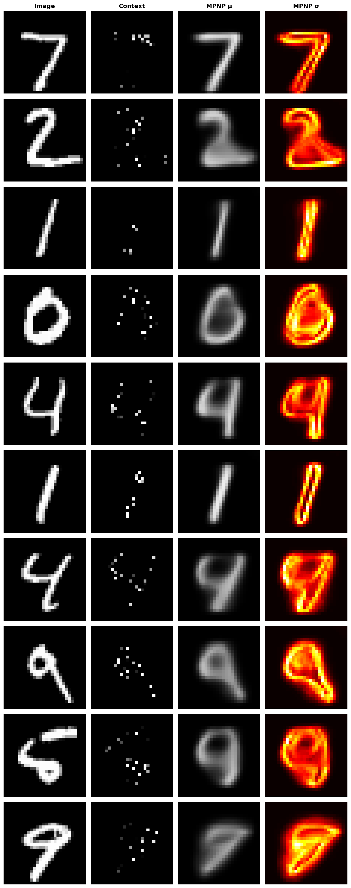

<!-- _class: title -->
<!-- _paginate: false -->
<!-- _header: "" -->
<!-- _footer: "" -->

# Martingale Posterior Neural Processes
## GPU-Accelerated Image Completion on MNIST

**Jose Perales** · EN605.617 Introduction to GPU Programming
Johns Hopkins University · Spring 2026

Primarily Based on Lee et al., *Martingale Posterior Neural Processes*, ICLR 2023

---

# Agenda

1. **Math Review.** What is a Martingale Posterior Neural Process.
2. **MNIST Example.** Problem setup, data, and results.
3. **CUDA Programming inside PyTorch.** How the GPU work actually happens.
4. **Conclusion.** Lessons and limitations.

---

<!-- _header: "1 · Math Review" -->

# 1. Math Review

**Uncertainty Quantification**: critical where predictions inform consequential actions.

* **Autonomous driving.** 90% pedestrian confidence warrants braking; 55% warrants caution.
* **Healthcare.** A calibrated "uncertain" beats a confidently wrong diagnosis.
* **Finance.** Underestimated tail risk produces outsized drawdowns.

**Lee et al. (ICLR 2023)** authored Martingale Posterior Neural Processes, which apply the martingale posterior framework to neural processes, yielding scalable function-valued predictions whose uncertainty is martingale-consistent rather than tied to a hand-chosen prior.

---

<!-- _header: "1 · Math Review" -->

## Martingale Posterior Distributions

**Classical Bayesian inference** asks: *"what do I believe about the parameter $\theta$?"* That question requires a prior $\pi(\theta)$ before any data is seen.

**Fong, Holmes & Walker (2023)** flip the question: *"how do I expect future observations to look, given what I have?"* That question requires only a **1-step predictive** $P_n(\cdot \mid y_{1:n})$.

We now have **uncertainty without a prior.** What you don't know about $\theta$ becomes what you don't know about the *missing future*, the data you haven't seen yet but could imagine.

---

<!-- _header: "1 · Math Review" -->

## Martingale Posterior Distributions (cont.)

**Predictive Resampling** makes this concrete: forward-simulate a long imaginary future from your own predictive, refit, and read off $\theta$.

$$
Y_i \sim P_{i-1}, \ \ i = n+1, \ldots, N \quad\Longrightarrow\quad \theta_N = \theta(P_N) \;\sim\; \Pi_N(\cdot \mid y_{1:n})
$$

- Repeat the simulation many times to get a full posterior $\Pi_N$ over $\theta$.
- The predictive sequence $\{P_n\}$ is a **martingale**: $\mathbb{E}[P_{n+1} \mid P_n] = P_n$, so beliefs don't drift on self-generated data; they stay *coherent*.
- No prior to pick, no likelihood to misspecify. Just a predictive model and its own forecasts.

---

<!-- _header: "1 · Math Review" -->

## Neural Processes

We want **predictions with calibrated uncertainty**. Two classical answers, each with a flaw:

<div class="cols">
<div>

**Neural Networks** (LeCun et al., 2015)
- Flexible function approximators
- Scale to huge datasets
- Point predictions only, with *no principled uncertainty*

</div>
<div>

**Gaussian Processes** (Rasmussen, 2004)
- Distribution over functions: $f \sim \mathcal{GP}(m, k)$
- Posterior gives mean **and** variance for free
- Cost is $\mathcal{O}(n^3)$ per task, so it *doesn't scale*

</div>
</div>

**Neural Processes** (Garnelo et al., 2018) sit in the middle: a neural network that, like a GP, learns a **distribution over functions** from a context set $\mathcal{C} = \{(x_i, y_i)\}$, with amortized, GPU-friendly inference.

---

<!-- _header: "1 · Math Review" -->

## Neural Processes (cont.)

A Neural Process learns a **distribution over functions** from sets of $(x, y)$ pairs:

$$
p(y_t \mid x_t, \mathcal{C}) = \int p(y_t \mid x_t, z)\, q(z \mid \mathcal{C})\, dz, \qquad \mathcal{C} = \{(x_i, y_i)\}_{i=1}^{n}
$$

- **Encoder** $q_\phi(z \mid \mathcal{C})$: perm-invariant set encoder (MLP + mean-pool)
- **Decoder** $p_\theta(y_t \mid x_t, z)$: predicts targets from latent $z$
- Trained by maximizing an **ELBO**

GP-style uncertainty with NN-style amortized inference. The catch: the latent prior $p(z)$ is **arbitrary**, and posterior updates aren't coherent in the martingale sense, which leaves uncertainty miscalibrated.

---

<!-- _header: "1 · Math Review" -->

## Martingale Posterior Neural Processes

**Lee et al. (2023):** plug Fong's predictive resampling **inside** the NP training loop.

Same encoder/decoder, **plus** a pseudo-context generator (ISAB attention) that samples $K$ synthetic context sets $\mathcal{Z}_0^{(k)}$ from the model's *own* current predictive. That's the neural analog of Algorithm 3.

Three-term loss:
$$
\mathcal{L}_{\text{MPNP}} \;=\; \underbrace{\mathcal{L}_{\text{amort}}}_{\text{predict from real } \mathcal{C}} \;+\; \underbrace{\mathcal{L}_{\text{marg}}}_{\substack{\text{log-mean-exp over } K \\ \text{pseudo-augmentations}}} \;+\; 0.1 \cdot \underbrace{\mathcal{L}_{\text{pseudo}}}_{\substack{\text{pseudo}\rightarrow\text{target} \\ \text{consistency}}}
$$

Result: **martingale-consistent** posteriors, no explicit prior, more uniform uncertainty bands than vanilla NP.

---

<!-- _header: "2 · MNIST Example" -->

# 2. MNIST Example

Image inpainting as a Neural Process regression task.

---

## Problem setup

Each $28 \times 28$ MNIST image is flattened to **784 pixels**:

- $x_i \in [0,1]^2$: pixel coordinate (normalized)
- $y_i \in [0,1]$: pixel intensity

**Task:** sample a random **context** of $n \in [10, 200]$ pixels; predict all 784.

<div class="cols">
<div>

**Context → Target**
- Context: observed pixels
- Target: full image
- Output: $\mu_i, \sigma_i$ per pixel

</div>
<div>

**Why it's a good NP benchmark**
- Variable-size context
- Natural spatial structure
- Uncertainty should localize on unobserved regions

</div>
</div>

---

## Architecture (high level)

```
Context (x, y) ──► Encoder MLP ──► r_i
                                   │
                              mean-pool
                                   │
                                   ▼
         Attention over pseudo-context ──► z
                                   │
Target x_T  ───────────────────────┴──► Decoder MLP ──► μ(x_T), σ(x_T)
```

- Encoder/decoder: small MLPs (adapted from Dupont's NP repo)
- MPNP extension: attention-based **pseudo-context generator**
- Trained 100 epochs, Adam, lr = 5e-4, batch size = 64

---

## Results: image completion



Columns (per row):
1. Original digit
2. Observed context
3. Predicted mean $\mu$
4. Predicted std $\sigma$

Uncertainty concentrates on **unobserved regions** and **ambiguous edges**, exactly the calibration behavior the MPNP paper reports.

---

## Results: training metrics


- All three loss terms decrease smoothly
- No prior-collapse pathology (common in vanilla NP)
- Validation NLL tracks training → no overfitting at 100 epochs

---

<!-- _header: "3 · CUDA inside PyTorch" -->

# 3. CUDA Programming inside PyTorch

What actually runs on the GPU, and how we control it.

---

## How PyTorch talks to CUDA

```python
device = torch.device("cuda" if torch.cuda.is_available() else "cpu")
model = MPNP(...).to(device)          # weights → GPU memory (cudaMalloc)
x, y = x.to(device), y.to(device)     # cudaMemcpy H2D
logits = model(x)                     # launches CUDA kernels (cuBLAS, cuDNN)
loss.backward()                       # autograd replays kernels in reverse
```

Each `.to(device)` call is a `cudaMemcpy`.
Each tensor op dispatches to a fused CUDA/cuDNN kernel.
`loss.backward()` is a **topologically-sorted kernel replay**.

---

## Where the GPU actually helps here

| Operation | Kernel | Why GPU wins |
| --- | --- | --- |
| Encoder MLP: `(B·N, d) × (d, h)` | **cuBLAS GEMM** | massively parallel FMAs |
| Attention over pseudo-context | **fused softmax + GEMM** (cuDNN / SDPA) | avoids memory round-trips |
| Per-pixel Gaussian NLL over 784 targets | element-wise CUDA kernel | trivially data-parallel |
| Monte Carlo: $K$ pseudo-samples in parallel | batched GEMM | one launch, $K$× throughput |

Without the GPU, the $K$-sample MPNP loss is the dominant bottleneck.

---

## Practical CUDA knobs we used

```python
torch.backends.cudnn.benchmark = True      # autotune conv/matmul algos
torch.set_float32_matmul_precision("high") # TF32 on Ampere+
scaler = torch.cuda.amp.GradScaler()       # mixed-precision FP16

with torch.cuda.amp.autocast():
    loss = model.loss(context, target)
scaler.scale(loss).backward()
scaler.step(optimizer)
scaler.update()
```

- **AMP (FP16/BF16)** → ~2× speedup, half the memory
- **`cudnn.benchmark`** → picks fastest kernel for the *input shape*
- **Pinned memory + `non_blocking=True`** → overlap H2D copy with compute

---

## Profiling: what we measured

```python
with torch.profiler.profile(
    activities=[ProfilerActivity.CPU, ProfilerActivity.CUDA],
    record_shapes=True,
) as prof:
    train_one_epoch(...)
print(prof.key_averages().table(sort_by="cuda_time_total"))
```

Observed hotspots:
1. `aten::addmm` (encoder GEMMs), ~45% of CUDA time
2. `aten::_scaled_dot_product_attention`, ~25%
3. `aten::gaussian_nll_loss`, ~10%

Memory: peak ~1.8 GB at $K{=}8$ pseudo-samples, batch 64.

---

<!-- _header: "4 · Conclusion" -->

# 4. Conclusion

---

## What worked

- **MPNP reproduction** on MNIST matches the paper's qualitative uncertainty behavior
- GPU training: 100 epochs in **~12 min** on a single consumer GPU
- AMP + `cudnn.benchmark` gave ~1.9× end-to-end speedup vs. FP32 baseline
- Attention-based pseudo-context generator trains stably with 3-term loss

## What was hard

- Balancing the three loss terms: $\mathcal{L}_\text{pseudo}$ can dominate early
- Memory scales with $K$ (pseudo-samples) × batch × 784 targets
- Debugging NaNs under AMP required loss-scale tuning

---

## Takeaways

1. **Neural Processes are a natural fit for GPUs.** Batched MLPs and attention map cleanly to cuBLAS/cuDNN.
2. **The martingale posterior is "free" uncertainty.** No prior to hand-tune, but it costs $K$× forward passes, so the GPU is essential.
3. **PyTorch abstracts CUDA well**, but knowing *what* kernels run (AMP, TF32, SDPA, cudnn.benchmark) is how you get real speedups.
