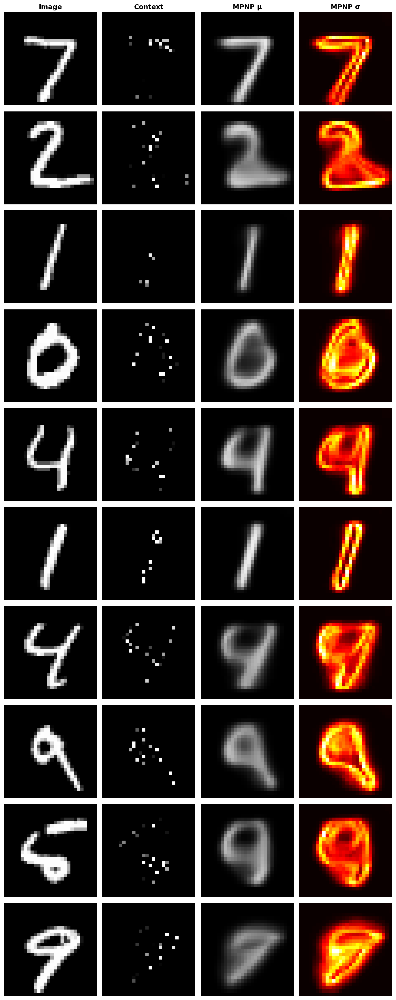
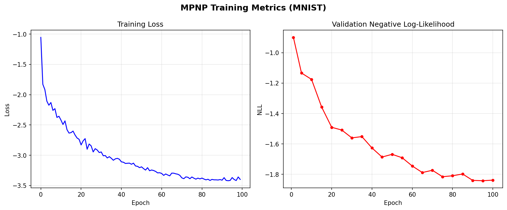

<!-- _class: title -->
<!-- _paginate: false -->
<!-- _header: "" -->
<!-- _footer: "" -->

# Martingale Posterior Neural Processes
## GPU-Accelerated Image Completion on MNIST

**Jose Perales** · EN605.617 Introduction to GPU Programming
Johns Hopkins University · Spring 2026

Primarily Based on Lee et al., *Martingale Posterior Neural Processes*, ICLR 2023

---

# Agenda

1. **Math Review.** What is a Martingale Posterior Neural Process.
2. **MNIST Example.** Problem setup, data, and results.
3. **CUDA Programming inside PyTorch.** How the GPU work actually happens.
4. **Conclusion.** Lessons and limitations.

---

<!-- _header: "1 · Math Review" -->

# 1. Math Review

**Uncertainty Quantification**: critical where predictions inform consequential actions.

* **Autonomous driving.** 90% pedestrian confidence warrants braking; 55% warrants caution.
* **Healthcare.** A calibrated "uncertain" beats a confidently wrong diagnosis.
* **Finance.** Underestimated tail risk produces outsized drawdowns.

**Lee et al. (ICLR 2023)** authored Martingale Posterior Neural Processes, which apply the martingale posterior framework to neural processes, yielding scalable function-valued predictions whose uncertainty is martingale-consistent rather than tied to a hand-chosen prior.

---

<!-- _header: "1 · Math Review" -->

## Martingale Posterior Distributions

**Classical Bayesian inference** asks: *"what do I believe about the parameter $\theta$?"* That question requires a prior $\pi(\theta)$ before any data is seen.

**Fong, Holmes & Walker (2023)** flip the question: *"how do I expect future observations to look, given what I have?"* That question requires only a **1-step predictive** $P_n(\cdot \mid y_{1:n})$.

We now have **uncertainty without a prior.** What you don't know about $\theta$ becomes what you don't know about the *missing future*, the data you haven't seen yet but could imagine.

---

<!-- _header: "1 · Math Review" -->

## Martingale Posterior Distributions (cont.)

**Predictive Resampling** makes this concrete: forward-simulate a long imaginary future from your own predictive, refit, and read off $\theta$.

$$
Y_i \sim P_{i-1}, \ \ i = n+1, \ldots, N \quad\Longrightarrow\quad \theta_N = \theta(P_N) \;\sim\; \Pi_N(\cdot \mid y_{1:n})
$$

- Repeat the simulation many times to get a full posterior $\Pi_N$ over $\theta$.
- The predictive sequence $\{P_n\}$ is a **martingale**: $\mathbb{E}[P_{n+1} \mid P_n] = P_n$, so beliefs don't drift on self-generated data; they stay *coherent*.
- No prior to pick, no likelihood to misspecify. Just a predictive model and its own forecasts.

---

<!-- _header: "1 · Math Review" -->

## Neural Processes

We want **predictions with calibrated uncertainty**. Two classical answers, each with a flaw:

**Neural Networks** (LeCun et al., 2015)
- Flexible function approximators
- Scale to huge datasets
- Point predictions only, with *no principled uncertainty*

**Gaussian Processes** (Rasmussen, 2004)
- Distribution over functions: $f \sim \mathcal{GP}(m, k)$
- Posterior gives mean **and** variance for free
- Cost is $\mathcal{O}(n^3)$ per task, so it *doesn't scale*

**Neural Processes** (Garnelo et al., 2018) sit in the middle: a neural network that, like a GP, learns a **distribution over functions** from a context set $\mathcal{C} = \{(x_i, y_i)\}$, with amortized, GPU-friendly inference.

---

<!-- _header: "1 · Math Review" -->

## Neural Processes (cont.)

A Neural Process learns a **distribution over functions** from sets of $(x, y)$ pairs:

$$
p(y_t \mid x_t, \mathcal{C}) = \int p(y_t \mid x_t, z)\, q(z \mid \mathcal{C})\, dz, \qquad \mathcal{C} = \{(x_i, y_i)\}_{i=1}^{n}
$$

- **Encoder** $q_\phi(z \mid \mathcal{C})$: perm-invariant set encoder (MLP + mean-pool)
- **Decoder** $p_\theta(y_t \mid x_t, z)$: predicts targets from latent $z$
- Trained by maximizing an **ELBO**

GP-style uncertainty with NN-style amortized inference. The catch: the latent prior $p(z)$ is **arbitrary**, and posterior updates aren't coherent in the martingale sense, which leaves uncertainty miscalibrated.

---

<!-- _header: "1 · Math Review" -->

## Martingale Posterior Neural Processes

**Lee et al. (2023):** plug Fong's predictive resampling **inside** the NP training loop.

Same encoder/decoder, **plus** a pseudo-context generator (ISAB attention) that samples $K$ synthetic context sets $\mathcal{Z}_0^{(k)}$ from the model's *own* current predictive. That's the neural analog of Algorithm 3.

Three-term loss:
$$
\mathcal{L}_{\text{MPNP}} \;=\; \underbrace{\mathcal{L}_{\text{amort}}}_{\text{predict from real } \mathcal{C}} \;+\; \underbrace{\mathcal{L}_{\text{marg}}}_{\substack{\text{log-mean-exp over } K \\ \text{pseudo-augmentations}}} \;+\; 0.1 \cdot \underbrace{\mathcal{L}_{\text{pseudo}}}_{\substack{\text{pseudo}\rightarrow\text{target} \\ \text{consistency}}}
$$

Result: **martingale-consistent** posteriors, no explicit prior, more uniform uncertainty bands than vanilla NP.

---

<!-- _header: "2 · MNIST Example" -->

# 2. MNIST Example

Image inpainting as a Neural Process regression task.

---

## Problem setup

Each $28 \times 28$ MNIST image is flattened to **784 pixels**:

- $x_i \in [-1,1]^2$: pixel coordinate (normalized)
- $y_i \in [0,1]$: pixel intensity

**Task:** sample a random **context** of $n \in [10, 300]$ pixels; predict all 784.

**Context → Target**
- Context: observed pixels
- Target: full image
- Output: $\mu_i, \sigma_i$ per pixel

**Why it's a good NP benchmark**
- Variable-size context
- Natural spatial structure
- Uncertainty should localize on unobserved regions

---

## Results: image completion

Columns (per row):
1. Original digit
2. Observed context
3. Predicted mean $\mu$
4. Predicted std $\sigma$

Uncertainty concentrates on **unobserved regions** and **ambiguous edges**, exactly the calibration behavior the MPNP paper reports.

---

## Results: training metrics

- All three loss terms decrease smoothly
- No prior-collapse pathology (common in vanilla NP)
- Validation NLL tracks training: no overfitting at 150 epochs

---

<!-- _header: "3 · CUDA inside PyTorch" -->

# 3. CUDA Programming inside PyTorch

A single MPNP training step issues dozens of CUDA kernel launches across cuBLAS, the caching allocator, and ATen's library of elementwise kernels. This section makes that implicit stack visible.

---

## How PyTorch uses CUDA

The dispatch chain every `tensor.op()` flows through:

| Layer | Role | Examples in this project |
| --- | --- | --- |
| **Python / `torch.nn`** | User-facing API | `nn.Linear`, `Normal.log_prob`, `loss.backward()` |
| **ATen** ("**A** **Ten**sor library") | C++ op dispatcher; picks backend by device + dtype | `aten::addmm`, `aten::mean`, `aten::log` |
| **CUDA backend** | Actual GPU code | cuBLAS (GEMM), cuDNN (conv), ATen native CUDA kernels (elementwise, reduction, softmax, layer_norm, Philox RNG) |

---

## How PyTorch uses CUDA (cont.)

When ATen routes a CUDA op, the actual kernel comes from one of two places:

- **cuBLAS / cuDNN**: NVIDIA-shipped vendor libraries
- **ATen native CUDA kernels**: written by the PyTorch team for everything else — `TensorIterator` elementwise/reduction ops (`add`, `mul`, `log`, `mean`), dedicated kernels (`softmax`, `layer_norm`), and the in-tree Philox-4x32 RNG

We wrote zero CUDA code. Every kernel below comes from one of those two sources.

---

## A training step, in three phases

Each MPNP training step decomposes into three phases, each touching a different layer of the CUDA stack:

1. **Data path** — host-to-device transfer and on-GPU sampling
2. **Forward path** — encoder, ISAB pseudo-context generator, decoder
3. **Loss + backward** — Gaussian NLL, autograd replay, optimizer step

The next three slides walk through what actually runs on the GPU in each phase.

---

## Phase 1 — Data path

`MNISTPointCloud` builds the $784 \times 2$ coordinate grid on CPU.

`DataLoader(pin_memory=True)` routes batches through page-locked host memory, so `x.to(device)` issues an async `cudaMemcpyAsync` that overlaps with the previous step's compute.

`torch.randperm(n, device=x.device)` runs the context/target split on the GPU via the in-tree **Philox-4x32** counter-based generator, avoiding a host round-trip.

Net effect: by the time the forward pass starts, the batch and its random permutation already live in device memory.

---

## Phase 2 — Forward path

`model.compute_loss(x_ctx, y_ctx, x_tgt, y_tgt)` calls `encode_set` once on the real context and $K{=}5$ more times inside the pseudo-context loop, with matching `decoder` calls.

- Each `nn.Linear` dispatches to `aten::addmm` → cuBLAS GEMM with bias fusion
- The hand-written ISAB block fires `matmul`, `softmax`, `layer_norm`
- The reparameterization $z = \mu + \sigma \odot \epsilon$ is one TensorIterator elementwise kernel

The pseudo-context loop is the cost driver: every encoder, ISAB, and decoder kernel fires $K{+}1$ times per step.

---

## Phase 3 — Loss + backward

`Normal.log_prob` expands into elementwise kernels (`log`, `pow`, `sub`, `div`) plus an `aten::mean`, fired $K{+}1$ times (once for the real context and once per pseudo-sample).

`loss.backward()` replays the gradient kernel for each forward op on the same CUDA stream, so the backward pass roughly mirrors the forward pass in launch count.

`AdamW.step()` is a single fused **multi-tensor** elementwise launch (`_foreach_*`) that updates every parameter tensor in one kernel rather than one launch per `Parameter`.

---

## Mapping MPNP ops to CUDA kernels — forward

| MPNP step | ATen op | Backend / kernel | Tensor shape |
| --- | --- | --- | --- |
| Encoder MLP (`Linear`+`ReLU`) | `addmm` | cuBLAS `cublasGemmEx` | $(B{\cdot}n, 256) \times (256, 256)$ |
| Mean-pool over context | `mean` | ATen reduction, `__shfl_down_sync` | $(B, n, 256) \to (B, 256)$ |
| ISAB MAB stack ($\times K$) | `matmul`, `softmax`, `layer_norm` | cuBLAS batched GEMM + ATen | $(B, 8, 30, 32)$ |
| Reparam. $z = \mu + \sigma \epsilon$ | `add`, `mul` | TensorIterator + Philox-4x32 | $(B, 256)$ |

---

## Mapping MPNP ops to CUDA kernels — decode, loss, optim

| MPNP step | ATen op | Backend / kernel | Tensor shape |
| --- | --- | --- | --- |
| Decoder MLP | `addmm` | cuBLAS `cublasGemmEx` | $(B{\cdot}T, 256) \times (256, 256)$ |
| Per-pixel Gaussian NLL | `log`, `pow`, `sub` | TensorIterator elementwise | $(B, 784, 1)$ |
| Manual log-sum-exp over $K$ | `max`, `exp`, `log` | 5 ATen kernels in sequence | $(K, B)$ |
| AdamW step | `_foreach_*` | multi-tensor elementwise | all params |

---

## Two structural facts about that table

1. **The pseudo-context loop multiplies launches.** Encoder, decoder, and per-pixel log-likelihood each fire $K{+}2$ times per training step (one real-context pass + $K$ pseudo-context passes). Anything per-launch is paid that many times.

2. **Almost every shape is fixed at architecture time.** The only ops whose shapes vary batch-to-batch are the encoder GEMM and the mean-pool reduction, both because $n \in [10, 300]$ varies. Everything else ($T{=}784$, $h{=}256$, $M{=}30$, $K{=}5$, 8 heads) is constant.

That combination (a small number of variable-shape ops, multiplied by $K{+}2$) is what makes MPNP a useful case study and not just another MLP-on-MNIST exercise.

---

<!-- _header: "4 · Conclusion" -->

# 4. Conclusion

---

## Conclusion

1. **Neural Processes are a natural fit for GPUs.** Batched MLPs and attention map cleanly to cuBLAS GEMMs and ATen elementwise kernels.
2. **The martingale posterior is "free" uncertainty.** No prior to hand-tune, but it costs $K{+}2$ forward passes per step, so the GPU is essential.
3. **PyTorch is a thin veneer over the CUDA stack.** Knowing which library kernel each `nn.Linear`, `log_prob`, and `randperm` actually launches is what lets you reason about cost.
